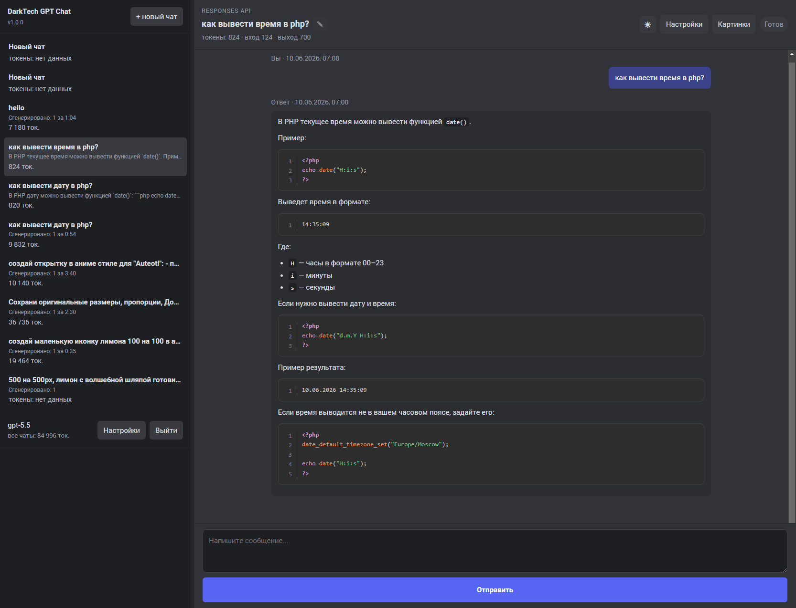
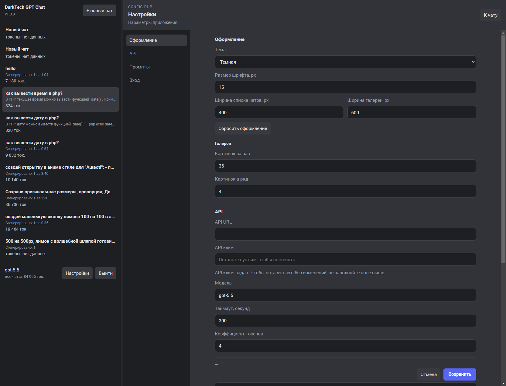
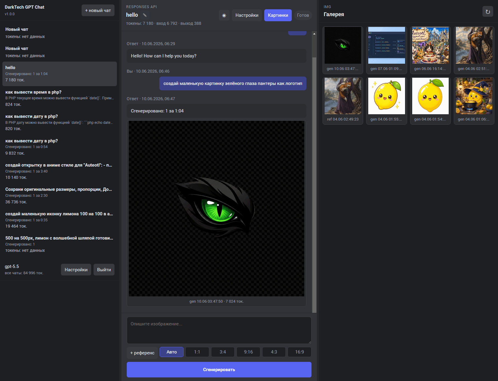

# DarkTech GPT Chat

Личный PHP/JS интерфейс для OpenAI-compatible Responses API. Его можно загрузить на свой сервер и использовать как приватный ChatGPT-подобный чат с генерацией изображений, референсами, галереей и настройками из браузера.

[Скачать ZIP-архив](https://github.com/DarkTechCode/darktech-gpt-chat/archive/refs/heads/main.zip)

## Скриншоты

## Описание

- Режим обычного чата по аналогии с chatgpt.com: история сообщений, список чатов, переименование чата, Markdown-ответы и подсветка блоков кода.
- Режим мультичата: можно отправить запрос в одном чате, переключиться на другой и продолжить писать там, пока предыдущий ответ или генерация выполняются в фоне.
- Режим генерации изображений через инструмент `image_generation` в Responses API.
- Референсы для генерации изображений: выбор файлов через проводник или перетаскивание PNG, JPEG, WEBP прямо на форму.
- Выбор пропорций картинок: авто, 1:1, 3:4, 9:16, 4:3, 16:9. Набор пропорций настраивается в `config.php`.
- Галерея изображений из `img` с порционной подгрузкой, обновлением и настройкой количества картинок.
- Просмотр изображения в модальном окне: можно сохранить файл, открыть оригинал, скопировать ссылку, перейти в чат генерации или добавить картинку в референсы.
- Настройки галереи: количество картинок за раз и количество колонок.
- Страница настроек для API URL, API-ключа, модели, таймаута, коэффициента токенов, пароля, промптов, галереи и оформления.
- Подсчет потраченных токенов по текущему чату, по списку чатов и по изображениям, если API возвращает `usage`.
- Пароль на вход. Его можно изменить или отключить в настройках.
- Отображение ошибок прямо в чате, включая детали сетевых/API-ошибок.
- Настройка ширины списка чатов и панели галереи.
- Светлая, темная и системная темы оформления, а также настройка размера шрифта.
- Оформление Markdown и блоков кода через `marked`, `DOMPurify` и `Prism`.
- Сохранение введенного текста отдельно для каждого чата в `localStorage`, чтобы случайное закрытие вкладки не уничтожало черновик.

## Настройка

1. Скачайте [ZIP-архив](https://github.com/DarkTechCode/darktech-gpt-chat/archive/refs/heads/main.zip) и загрузите файлы проекта на сервер с PHP 7.4+ (рекомендуется PHP 8+).
2. Убедитесь, что PHP может записывать в `config.php`, `data` и `img`.
3. Откройте `index.php` в браузере.
4. Войдите с паролем из `config.php` - по умолчанию это `neurogate`.
5. Откройте `Настройки` и заполните `API URL` и `API ключ`.
6. При необходимости измените модель, таймаут, коэффициент токенов, промпты, пароль, галерею и оформление.

После сохранения настроек приложение готово к работе. Редактировать `config.php` вручную обычно не нужно.

## Где хранятся данные

- История чатов: `data/chats.json`.
- Сгенерированные изображения и сохраненные референсы: `img`.
- Настройки приложения: `config.php`.
- Пользовательские настройки оформления, ширины панелей и черновики сообщений: `localStorage` браузера.

## Важные детали

- Backend использует `/v1/responses`, а не `/v1/images/generations`.
- `api.stream` должен оставаться `true`: backend отклоняет нестриминговые Responses-запросы.
- В `api.model` указывается Responses-модель, доступная у вашего API-провайдера.
- Обычный чат отправляет в API только текстовую историю текущего чата.
- Маски для редактирования изображений не реализованы. Редактирование работает через референс-картинки, отправленные как base64 data URL.
- Быстрые пропорции задают параметр `size`; если API-провайдер отклоняет конкретный размер, измените mapping в `image.ratios`.
- Токены считаются точно только если `/responses` возвращает поле `usage`; иначе интерфейс показывает, что данных нет.
- Отображаемые токены умножаются на `usage.token_multiplier`.

## Безопасность

Страница приложения закрыта паролем, если он задан в `config.php`. Для Apache добавлены `.htaccess`-файлы, которые закрывают `config.php`, `src` и `data`, а также запрещают выполнение PHP в `img`.

Если хостинг работает на Nginx, проверьте аналогичные правила в настройках сайта.
